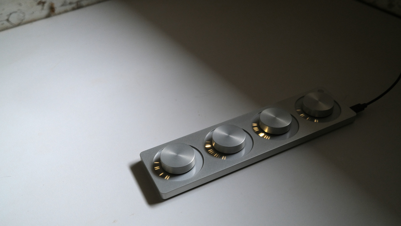

arc is a tactile instrument with dynamic visual feedback. applications determine the interaction between movement, sound, and light. some applications are shared here and we've created studies to help you create your own.

## specifications

- high resolution knobs, 1024 ticks per revolution.
- each knob is encircled by a sixty-four segment light ring, sixteen-step brightness per LED.
- 2025 edition has a single pushbutton. see [editions](editions) for more details).

## with computers

[first install serialosc](/docs/serialosc/setup). serialosc runs in the background and converts usb serial communication into OpenSound Control (OSC). Applications query serialosc to connect to a grid or arc.

### applications

[VCV Rack](/docs/grid/computer/vcv-rack) is a virtual modular synth. The Ansible module communicates with the arc. 

[Max](http://cycling74.com/products/max) is a patching environment created by Cycling '74. A free runtime is available. Max for Live is a part of Ableton Live Suite. The following work with Max or Max for Live:

* [max package](/docs/grid/app/package) -- several patchers and tools for use within Max
* [returns](https://github.com/monome-community/returns) –- simple yet versatile cc output with LFOs and sensitivity control.
* [capstarc](https://github.com/mhetrick/capstarc) -- tactile sample scrubbing for arc
* [cascades](https://l.llllllll.co/cascades/) -- 65,536 combinations of 16th note patterns across seven tracks
* [pear](https://llllllll.co/t/32699) -- dual manual tape player
* [arc4live](https://github.com/robbielyman/arc4live/tree/main) -- simplified arc-as-four-knobs Max for Live patch featuring trimmers on modulation range
* more patches can be found at the library of [llllllll.co](https://llllllll.co/tag/max). also see the [monome-community github](https://github.com/orgs/monome-community/) and the
 [collected repository](https://github.com/monome-community/collected).
 
### studies

- (sc)

note, the [grid studies](https://monome.org/docs/grid/grid-computer/#studies) broadly apply to the arc but the OSC patterns differ.

## with norns

<iframe src="https://player.vimeo.com/video/312196152?color=ffffff&title=0&byline=0&portrait=0" width="860" height="484" frameborder="0" webkitallowfullscreen mozallowfullscreen allowfullscreen></iframe>

[angl](https://llllllll.co/t/ash-a-small-collection/21349) is the script used in this video. it is part of the `ash` collection from monome, which can be installed via [maiden](/docs/norns/maiden).

selection of community contributed scripts that support arc:

- [4 Big Knobs](https://llllllll.co/t/4-big-knobs/42190): send control voltages out of [crow](/docs/crow)
- [arcify](https://llllllll.co/t/arcify/22133): map arc to norns parameters
- [easygrain](https://llllllll.co/t/easygrain/21047): granulator with arc support
- [larc](https://llllllll.co/t/larc/39790): three play-heads, one rec-head

## with modular

<iframe src="https://player.vimeo.com/video/182119406?color=ffffff&title=0&byline=0&portrait=0" width="860" height="484" frameborder="0" webkitallowfullscreen mozallowfullscreen allowfullscreen></iframe>

[Ansible](/docs/ansible) (discontinued) connects an arc to the eurorack ecosystem.

See [VCV Rack](/docs/grid/computer/vcv-rack) to use a virtual version on your computer, which can then be interfaced to your modular synth in various ways.

## further information

- [editions](editions) - information about different device generations
- [disassembly](disassembly) - guides for disassembling the hardware
- [2015-2019 edition knob reconditioning howto](https://vimeo.com/449444177)
