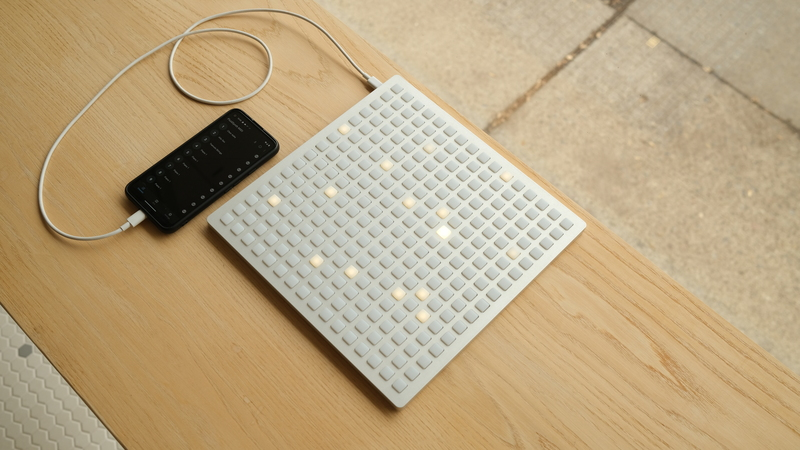

# iii

_PRELIMINARY: we're approaching version 1.0.0. some features may change before then!_

An evolution of capabilities for monome grid and arc, where an interactive scripting environment runs on the device itself.

- scripting is in Lua (which is familiar to [norns](https://monome.org/docs/norns) and [crow](https://monome.org/docs/crow))
- scripts can be uploaded and stored, to be executed on startup
- in addition to USB-TTY access to the scripting REPL, the device enumerates as USB-MIDI and provides scripting control over all MIDI communication
- Lua libraries are provided for time-based operations (metros, measurement) and writing arbitrary data to the internal flash (ie: presets or stored sequences)

## why do this?

The grid was originally conceived of as "doing nothing by itself" without being connected to a computer running a program. Now, the tiny computer inside the grid (RP2040) is capable enough of doing some interesting things. We're hoping this means in some cases simply requiring less complexity (as in, a specialized eurorack module or DAW plugin or tricky command line framework). It also provides the possibility to connect to less-general-purpose computers (like phones) who prefer MIDI.

That said, the original method of interfacing via norns or serialosc (and any of the [various languages and environments](https://monome.org/docs/grid/grid-computer/)) is a fundamentally excellent approach. iii fills a small gap.

The new firmware is capable of toggling between iii and monome/serial modes.

## compatibility

grid -- [editions](/docs/grid/editions)

- yes: 2022 and later grids (includes grids one and zero)
- no: 2020-2021 grids use different microcontroller, hence cannot use this firmware. (they are, however, mechanically compatible so we are considering a PCB upgrade. TBA.)
- no: all other grids use an FTDI USB Serial chip which means they can't do USB-MIDI. 

arc -- [editions](/docs/arc/editions)

- yes: 2025. has pushbutton.
- no: everything else

## firmwares

Note: arc ships with iii support. This process is not needed.

- Download the [most recent firmware for your specific device](https://github.com/monome/iii/releases) (Note that grids from 2022 have a different LED driver and hence require a different firmware. Identify the PCB revision by checking the date on the corner).
- Remove the bottom screws.
- Locate the golden pushbutton near the USB port. Hold it down while connecting the grid to a computer. This will start the device in bootloader mode.
- A USB drive will enumerate. Download the appropriate firmware listed below and copy the file to this drive. The drive will unmount immediately upon copying the file (on macOS this may cause a benign alert).
- Disconnect and put the screws back on (make sure to place the spacers first).

For firmware _updates_ you can use the `diii` command `^^b` to reboot the device into bootloader mode without opening the unit again.


## modes

The "mode" is indicated by the startup light pattern.

- particles: this is standard monome/serial mode, compatible with norns, serialosc, ansible, etc.
- plasma: iii mode with a blank script.
- something else: previously uploaded iii script.

To change the mode, while powering up the device hold down
- grid: key 1,1 (top left) 
- arc: there's only one key

To force-clear a script, switch _into_ iii mode while holding down the key for two full seconds. (This may be helpful for debugging a locked-up script).

## diii

A terminal text interface for iii devices, based on [druid](https://monome.org/docs/crow/druid/). Send commands, get text feedback, and upload scripts. See the source [here](https://github.com/monome/diii).

### install

Requires `python` and is installable via `pip`:

```
sudo pip3 install monome-diii
```

(For extended install instructions see [druid's install guide](https://monome.org/docs/crow/druid/#install-druid) and remember to replace `monome-druid` with `monome-diii`).

### run

For ease of managing scripts, navigate to the folder with your iii scripts ie:

```
cd ~/iii
```

Type `diii` in a terminal.

If things are working, it will report your device connected.  
A few quick commands:

```
^^p         print script
^^c         clear script
^^z         reboot script
^^r         reboot device
^^b         reboot into bootloader mode
```

To upload a script:

```
u step.lua
```

To re-upload the same script, you can just execute `u`.

All other commands will be passed to the device's Lua environment and any results will be printed.

To quit, execute `q` or CTRL-C.


## writing scripts

See the [repository](https://github.com/monome/iii) for a few example scripts. This is also where [discussion](https://github.com/monome/iii/discussions) happens.

There is preliminary documentation on the README. We'll move it here with examples and studies once the feature set is finalized.


## library

arc

- [cycles](library/cycles) - rotating midi cc with friction
- [erosion](library/erosion) - four by four meta cc with interpolation and scene recall
- [snows](library/snows) - very slow asynchronous arpeggiator

